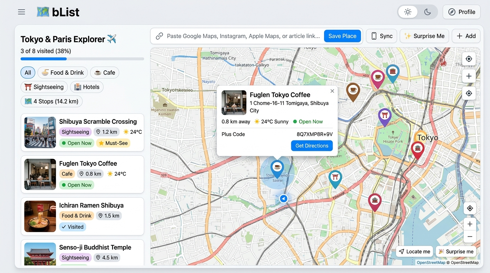
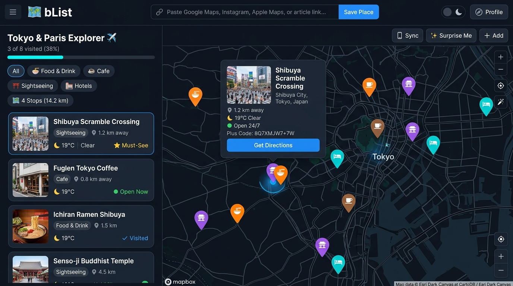
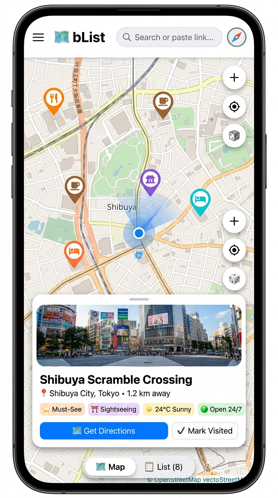

# 🗺️ bList — Visual Map Bucket List & Trip Planner

<div align="center">

[](https://github.com/radmuffin/bList/actions/workflows/ci.yml)
[](LICENSE)
[](https://www.rust-lang.org/)
[](https://github.com/tokio-rs/axum)
[](https://leafletjs.com/)
[](#-mobile--pwa-experience)
[](#-security-privacy--telemetry)

**A lightweight, blazing-fast, privacy-first visual map bucket list and trip planner written in Rust.**  
Paste or share links from Google Maps, Apple Maps, Instagram, or travel blogs to automatically extract place metadata, photos, coordinates, and visualize them on an interactive map.

[Live Demo](https://blist-radmuffin.fly.dev) • [Key Features](#-key-features) • [Quick Start](#-quick-start) • [Architecture](#-architecture--tech-stack) • [Contributing](#-contributing) • [Deployment](#-deployment--cloud-hosting)

</div>

---

## 📸 App Preview

<div align="center">
  
  <p><em>Desktop Experience: Interactive Map with Custom Category Pins, Progress Tracking, Omni-Link Ingestion & Route Distance Summaries</em></p>
</div>

<p align="center">
  
  
</p>
<p align="center">
  <em>Left: Dark Mode with Esri Dark Canvas & glowing markers. Right: Mobile PWA with bottom drawer and one-tap directions.</em>
</p>

---

## ⚡ Key Features

### 1. 📥 Omni-Link Saving & Deterministic Scraping
- **Google Maps Places & Businesses**: Parses place IDs, direct coordinates (`!3dlat!4dlng`), standard coordinates (`@lat,lng`), shortened links (`maps.app.goo.gl`), and automatically falls back to OpenStreetMap Nominatim for search query resolution.
- **Apple Maps**: Extracts coordinates directly from URL query parameters (`ll=lat,lng`), addresses, and search query strings.
- **Instagram**: Deterministically scrapes location signals, captions, and media thumbnails.
- **Travel Articles & Blogs**: Extracts OpenGraph tags, JSON-LD Schema (`Place`, `Restaurant`, `LocalBusiness`), or reverse-geocodes article titles.
- **SSRF Hardened**: All outbound HTTP requests are validated against private IP ranges (RFC 1918, link-local, loopback) with DNS pinning to eliminate Time-of-Check to Time-of-Use (TOCTOU) rebinding attacks.

### 2. 📱 Mobile-First PWA & Multi-Device Sync
- **Native Web Share Target API**: When installed on iOS or Android, **bList appears directly in your phone's native Share Sheet**. Select "Share" inside Google Maps, Instagram, or Safari, and save links directly into your trip list in seconds.
- **Capacitor Mobile Apps**: Ready to build as native iOS and Android packages (`android/` & `ios/`).
- **Instant Anonymous Device Sync**: Pair your phone and desktop via QR Code or cryptographic Sync Key (`X-User-Token`)—no passwords, emails, or personal accounts required.
- **Trip Sharing & Collaboration**: Share custom trips with a unique collaboration link (`/lists/join`).
- **Offline Map Tile Caching**: Built-in Service Worker automatically caches browsed map tiles for offline navigation in areas with spotty cellular coverage.

### 3. ⚡ Route Optimization & Itinerary Planning
- **1-Click 2-Opt TSP Route Optimizer**: Automatically calculates the most efficient travel sequence between saved pins to eliminate backtracking.
- **Multi-Stop Navigation**: Calculates sequential route distances and generates 1-click turn-by-turn multi-stop routes directly in Google Maps.
- **Day Itinerary Grouping & Tags**: Organize places by itinerary day (Day 1, Day 2, etc.) or custom tags (`#coffee`, `#sunset`, `#ramen`).
- **Priority Filtering**: Flag must-see highlights with the ⭐ Must-See filter.

### 4. 🎯 Location-Aware Map & Delightful UX
- **Locate Me**: One-tap GPS lookup displaying your live position with a pulsing radar marker and directional beam.
- **Live Distance Calculations**: Computes real-time distances (`1.2 km away` / `0.8 mi away`) on cards and marker popups relative to your location.
- **Opening Hours & Open Now Status**: Live indicators show whether a place is currently open, open 24/7, or closing soon.
- **Plus Codes (Open Location Codes)**: Automatic Plus Code generation and 1-click copy for precise geolocation even without street addresses.
- **Weather Widget ☀️**: Displays real-time temperature and weather indicators for every saved pin.
- **Dark Mode**: Seamless system theme matching (`prefers-color-scheme: dark`) and manual toggle (☀️ Light / 🌙 Dark / 💻 System Auto). Map layer dynamically adapts to Esri Dark Canvas.
- **Surprise Me 🎲**: Randomly picks an unvisited spot on your list, flies the map to the location, and opens its detail card.

### 5. 📂 Universal Import & Data Portability
- **Google Takeout Import**: Easily migrate from Google Maps by importing `Saved Places.json` or `Saved Places.csv`.
- **Universal GIS Import**: Supports GeoJSON and CSV imports.
- **One-Click Export**: Export your trips anytime in GeoJSON, CSV, or JSON format. You own your data.

### 6. 🏆 Travel Milestones & Gamification
- **Achievement Badges**: Unlock collectible badges as you travel and explore (e.g., *Trailblazer*, *First Stamp*, *Noodle Hunter*, *Nature Lover*, *Secret Cartographer*).
- **Trip Progress Tracker**: Visual progress bar showing visited percentage and completion milestones for each trip list.

### 7. 🔒 Security, Privacy & Telemetry
- **Zero Tracking**: No Google Analytics, no tracking cookies, no third-party ad scripts.
- **Prometheus Telemetry**: Native `/metrics` endpoint (`src/metrics.rs`) exposing HTTP request metrics (`2xx`, `4xx`, `5xx`) and service uptime.
- **Security Headers**: Production-ready headers (`X-Content-Type-Options: nosniff`, `X-Frame-Options: SAMEORIGIN`, `Referrer-Policy: strict-origin-when-cross-origin`) attached via Axum middleware.

---

## 🏛️ Architecture & Tech Stack

```
┌────────────────────────────────────────────────────────────────────────┐
│                              FRONTEND                                  │
│  Vanilla ES6+ JS  •  CSS Variables  •  Leaflet.js  •  Service Worker   │
│  (Zero bundler lock-in, instant load, native PWA Web Share Target)     │
└───────────────────────────────────┬────────────────────────────────────┘
                                    │ HTTP / REST / JSON
┌───────────────────────────────────▼────────────────────────────────────┐
│                           BACKEND (Rust)                               │
│  Axum 0.7  •  Tokio Async Runtime  •  Reqwest + Scraper  •  Nominatim │
│  SSRF Defense & DNS Pinning  •  Prometheus Telemetry  •  2-Opt TSP     │
└───────────────────────────────────┬────────────────────────────────────┘
                                    │ Parameterized SQL
┌───────────────────────────────────▼────────────────────────────────────┐
│                           DATABASE & STORAGE                           │
│  SQLite (rusqlite) in WAL Mode  •  Foreign Key Cascades  •  NVMe Volume│
└────────────────────────────────────────────────────────────────────────┘
```

| Layer | Technology | Purpose |
|---|---|---|
| **Backend** | [Rust 2021](https://www.rust-lang.org/) + [Axum 0.7](https://github.com/tokio-rs/axum) | High-concurrency, memory-safe web server |
| **Async Runtime** | [Tokio](https://tokio.rs/) | Asynchronous I/O and task scheduling |
| **Database** | SQLite via [rusqlite](https://github.com/rusqlite/rusqlite) | Embedded relational storage running in WAL mode |
| **Frontend** | Vanilla JS (ES6+) + Modern CSS | Blazing-fast SPA without build step overhead |
| **Mapping Engine** | [Leaflet.js](https://leafletjs.com/) + OpenStreetMap | Interactive vector and tile map rendering |
| **Mobile Runtime** | [Capacitor 6](https://capacitorjs.com/) | Native packaging for iOS and Android |
| **Telemetry** | Prometheus `/metrics` | Request latency, status code counters, and uptime |

---

## 🚀 Quick Start

### Prerequisites
- **[Rust](https://www.rust-lang.org/tools/install)** (1.75 or later)
- **[Node.js](https://nodejs.org/)** (v20 or later) & `npm`

### Local Setup

```bash
# 1. Clone the repository
git clone https://github.com/radmuffin/bList.git
cd bList

# 2. Install Node dependencies (for testing & mobile tooling)
npm install

# 3. Run the development server
cargo run
```

Open **`http://localhost:3000`** in your browser. Any modifications to files in `static/` take effect immediately upon browser refresh.

---

## 🧪 Testing & Quality Assurance

bList follows a fast, deterministic testing strategy designed for rapid local feedback and robust CI verification:

```bash
# ⚡ 1. Rapid Affected Check (<5s) — Inspects git diff and runs only impacted suites
npm run test:affected

# 🧪 2. Frontend Unit & Accessibility Tests
npm test

# 🦀 3. Backend Rust Tests & Database Suite
cargo test

# 🔍 4. Rust Linting & Formatting
cargo fmt --all -- --check
cargo clippy --all-targets -- -D warnings

# 🌐 5. Trigger Full Parallel Test Suite in CI (Playwright Multi-Browser Matrix)
npm run test:branch-ci
```

### Git Pre-Push Hook
Install the pre-push hook to automatically run affected tests before pushing code:
```bash
npm run setup:hooks
```

---

## 📱 Mobile & PWA Experience

### Web App (PWA)
1. Open `https://blist-radmuffin.fly.dev` in Safari (iOS) or Chrome (Android).
2. Tap **Share** (iOS) or the **three dots menu** (Android) → **"Add to Home Screen"**.
3. bList will now appear in your system Share Sheet when sharing links from Google Maps, Instagram, or browser tabs!

### Building Native Android / iOS Packages (Capacitor)
```bash
# Sync web assets to native platforms
npm run cap:sync

# Open Android Studio for APK/AAB builds
npm run cap:open:android

# Open Xcode for iOS builds
npm run cap:open:ios
```

For Google Play Store submission instructions, see **[`deploy/ANDROID_RELEASE_GUIDE.md`](deploy/ANDROID_RELEASE_GUIDE.md)**.

---

## ☁️ Deployment & Cloud Hosting

### 1. Production (Fly.io)
👉 **[https://blist-radmuffin.fly.dev](https://blist-radmuffin.fly.dev)**

- **Configuration**: Managed via [`fly.toml`](fly.toml) with a persistent NVMe volume mounted at `/data` for SQLite durability.
- **Deploy via Fly CLI**:
  ```bash
  fly deploy --local-only
  ```

### 2. Staging Deployment (GitHub Actions)
Deploy any feature branch to the staging environment (**[https://blist-staging-radmuffin.fly.dev](https://blist-staging-radmuffin.fly.dev)**):
1. Navigate to the **Actions** tab on GitHub.
2. Select **"CD - Deploy to Staging"**.
3. Click **"Run workflow"** and enter your branch name.

### 3. AWS & GCP Deployment Guides
- **Amazon Web Services (EC2 / ECS)**: See **[`deploy/AWS_DEPLOYMENT.md`](deploy/AWS_DEPLOYMENT.md)**
- **Google Cloud Platform (Cloud Run)**: See **[`deploy/GCP_DEPLOYMENT.md`](deploy/GCP_DEPLOYMENT.md)**

### 4. Docker Container
```bash
# Build multi-stage optimized image
docker build -t blist .

# Run container locally on port 3000
docker run -p 3000:3000 -v $(pwd)/data:/data blist
```

---

## 🤝 Contributing

We love contributions! bList is an open-source project and welcomes developers, designers, and testers of all skill levels.

Whether you want to:
- 🦀 Add a scraper for a new travel blog or maps platform in `src/scraper.rs`
- 🎨 Design a new map theme or refine mobile UI components in `static/`
- 📱 Enhance Capacitor plugins or offline PWA capabilities
- 🧪 Write new unit, integration, or accessibility test cases
- 📖 Improve documentation, guides, or localization

Please check out our **[`CONTRIBUTING.md`](CONTRIBUTING.md)** guide for step-by-step setup instructions, architectural rules, and pull request guidelines.

---

## 📄 License

This project is licensed under the **MIT License** — see the [`LICENSE`](LICENSE) file for details.

<div align="center">
  <sub>Built with ❤️ for travelers, explorers, and cartography enthusiasts.</sub>
</div>
