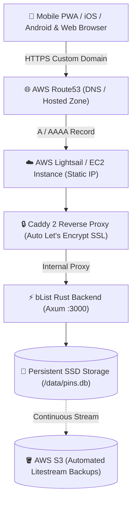

# 🌐 AWS Production Deployment Guide for bList

This guide provides step-by-step instructions for deploying **bList (Visual Map Bucket List & Trip Planner)** to **Amazon Web Services (AWS)** with a custom domain managed by **AWS Route53**, automated Let's Encrypt SSL/TLS certificates via Caddy, and persistent NVMe/SSD storage for SQLite (`pins.db`).

---

## 🏗️ Architecture Overview



---

## 📋 Recommended Deployment Options Comparison

| Option | Monthly Cost | Storage Persistence | Zero-Ops Maintenance | Recommended For |
|---|---|---|---|---|
| **AWS Lightsail** (Recommended) | **$3.50 - $5.00** | ✅ Dedicated SSD Block Storage | ⭐⭐⭐⭐⭐ (Easiest) | **Personal & Production Deployments** |
| **AWS EC2 + EBS** | $4.50 - $8.00 | ✅ Persistent EBS Volume | ⭐⭐⭐⭐ | Teams with existing AWS VPCs |
| **Fly.io + Route53** | $0.00 - $3.00 | ✅ NVMe Persistent Volume | ⭐⭐⭐⭐⭐ | 1-command ultra-low latency edge deploy |

---

## 🚀 Option A: AWS Lightsail Deployment ($3.50/mo - Recommended)

AWS Lightsail is the most cost-effective and straightforward way to run bList with a static IP and persistent SSD storage.

### Step 1: Launch an AWS Lightsail Instance
1. Open the [AWS Lightsail Console](https://lightsail.aws.amazon.com/).
2. Click **Create instance**.
3. Choose your closest region (e.g. `us-east-1`, `eu-west-1`).
4. Select Platform: **Linux/Unix**.
5. Select Blueprint: **OS Only** -> **Ubuntu 24.04 LTS** (or **Amazon Linux 2023**).
6. Choose the **$3.50/mo** plan (512MB RAM, 1 vCPU, 20GB SSD, 1TB transfer) or **$5.00/mo** (1GB RAM, 2 vCPUs).
7. Name your instance: `blist-production`.
8. Click **Create instance**.

### Step 2: Attach a Static IP & Open Ports
1. In the Lightsail console, go to the **Networking** tab.
2. Click **Create static IP** and attach it to your `blist-production` instance.
3. Note your Public Static IP (e.g. `54.210.120.45`).
4. Under the **IPv4 Firewall** rules for the instance, ensure the following ports are open:
   - **HTTP (TCP 80)** - for ACME challenge & HTTP->HTTPS redirect
   - **HTTPS (TCP 443)** - for secure TLS traffic
   - **Custom (UDP 443)** - for HTTP/3 QUIC performance
   - **SSH (TCP 22)** - for terminal management

---

## 🌐 Step 3: Configure AWS Route53 Custom Domain

1. Open the [AWS Route53 Console](https://console.aws.amazon.com/route53/).
2. Select your **Hosted Zone** for your domain (e.g. `yourdomain.com`).
3. Click **Create record**:
   - **Record name**: `blist` (or leave empty for apex domain `yourdomain.com`)
   - **Record type**: `A - Routes traffic to an IPv4 address`
   - **Value**: Enter your Lightsail static IP (e.g. `54.210.120.45`)
   - **TTL**: `300` seconds (5 minutes)
4. *(Optional for Apex)* Create a `CAA` record to allow Let's Encrypt:
   - **Record type**: `CAA`
   - **Value**: `0 issue "letsencrypt.org"`
5. Save the record. DNS propagation takes 1-5 minutes.

---

## 💻 Step 4: Provision Server & Launch bList with Docker Compose

SSH into your Lightsail instance:

```bash
ssh ubuntu@<YOUR_STATIC_IP>
```

### 1. Install Docker & Docker Compose Plugin
```bash
# Update and install Docker
sudo apt update && sudo apt install -y docker.io docker-compose-v2 git

# Allow ubuntu user to manage docker without sudo
sudo usermod -aG docker ubuntu
newgrp docker
```

### 2. Clone bList Repository & Configure Environment
```bash
git clone https://github.com/<your-username>/map-bucket-list.git /opt/blist
cd /opt/blist/deploy

# Create production environment configuration
cat << 'EOF' > .env
DOMAIN=blist.yourdomain.com
ACME_EMAIL=admin@yourdomain.com
EOF
```

### 3. Launch the Stack
```bash
docker compose -f docker-compose.prod.yml up -d
```

### 4. Verify Containers and SSL Certificate
```bash
docker compose -f docker-compose.prod.yml ps
docker compose -f docker-compose.prod.yml logs -f caddy
```
Caddy will automatically obtain a valid Let's Encrypt SSL certificate and proxy all requests to bList!

---

## 🔄 Step 5: Configure Automatic Systemd Service

To ensure bList automatically starts on server reboots or kernel upgrades:

```bash
sudo cat << 'EOF' > /etc/systemd/system/blist.service
[Unit]
Description=bList Production Docker Compose Application
Requires=docker.service
After=docker.service

[Service]
Type=oneshot
RemainAfterExit=yes
WorkingDirectory=/opt/blist/deploy
ExecStart=/usr/bin/docker compose -f docker-compose.prod.yml up -d
ExecStop=/usr/bin/docker compose -f docker-compose.prod.yml down

[Install]
WantedBy=multi-user.target
EOF

sudo systemctl daemon-reload
sudo systemctl enable blist.service
```

---

## 💾 Step 6: Automated SQLite Backups to AWS S3 (Litestream)

SQLite in WAL (Write-Ahead Logging) mode is resilient, fast, and lightweight. To ensure zero data loss, stream SQLite transactions directly to an AWS S3 bucket using Litestream or daily S3 backup cron jobs.

### Method 1: S3 Snapshot Cron Job
```bash
# 1. Install AWS CLI
sudo apt install -y awscli

# 2. Create S3 Bucket in AWS Console
# e.g., s3://blist-backups-production/

# 3. Create Daily Backup Script
sudo mkdir -p /opt/blist/scripts
sudo cat << 'EOF' > /opt/blist/scripts/backup.sh
#!/bin/bash
DATE=$(date +%Y%m%d_%H%M%S)
BACKUP_DIR="/tmp/blist_backups"
mkdir -p $BACKUP_DIR

# Safe atomic online SQLite backup without stopping container
docker exec blist_backend sqlite3 /data/pins.db ".backup '$BACKUP_DIR/pins_$DATE.db'"

# Gzip and push to S3
gzip $BACKUP_DIR/pins_$DATE.db
aws s3 cp $BACKUP_DIR/pins_$DATE.db.gz s3://blist-backups-production/backups/pins_$DATE.db.gz
rm -rf $BACKUP_DIR
echo "[$(date)] bList database backup completed successfully to S3."
EOF

sudo chmod +x /opt/blist/scripts/backup.sh

# 4. Add to Cron (runs daily at 3:00 AM)
(crontab -l 2>/dev/null; echo "0 3 * * * /opt/blist/scripts/backup.sh >> /var/log/blist-backup.log 2>&1") | crontab -
```

---

## ⚡ Option B: Fly.io + AWS Route53 (Zero-Ops Alternative)

If you prefer a fully managed serverless VM with persistent NVMe SSD storage:

1. Install Fly CLI: `curl -L https://fly.io/install.sh | sh`
2. Authenticate: `fly auth login`
3. Launch bList:
   ```bash
   fly launch --no-deploy
   ```
4. Create persistent volume:
   ```bash
   fly volumes create blist_data --size 1 --region ord
   ```
5. Deploy:
   ```bash
   fly deploy
   ```
6. Add Route53 custom domain:
   ```bash
   fly certs add blist.yourdomain.com
   ```
   Follow the output to add the CNAME / A record in Route53. SSL will be issued automatically.

---

## 📱 Verifying Web Share Target API on Mobile

Once your custom domain is live over HTTPS (e.g. `https://blist.yourdomain.com`):
1. Open the URL in **Safari on iOS** -> tap **Share** -> **Add to Home Screen**.
2. Open the URL in **Chrome on Android** -> tap **Install bList** or **Add to Home screen**.
3. Go to **Google Maps** or **Instagram**, find any place/reel, tap **Share**, and choose **bList**.
4. The link will be instantly ingested into your bucket list with a toast notification!
