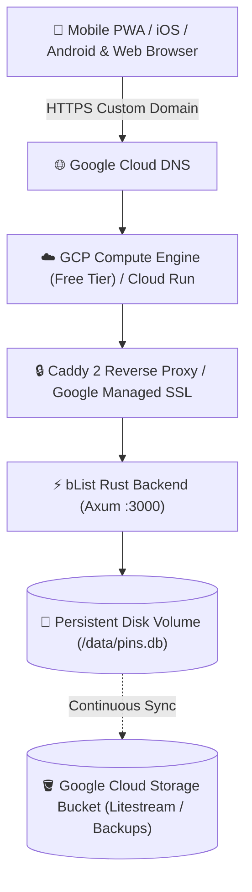

# 🌐 Google Cloud Platform (GCP) Deployment Guide for bList

This guide details how to deploy **bList (Visual Map Bucket List & Trip Planner)** to **Google Cloud Platform (GCP)** with persistent SQLite storage, custom domain mapping via **Google Cloud DNS**, and automated SSL/TLS certificates.

---

## 🏗️ Architecture Overview



---

## 📋 Deployment Options Comparison

| Strategy | Cost | Storage Persistence | Complexity | Recommendation |
|---|---|---|---|---|
| **Google Compute Engine (GCE e2-micro)** | **$0.00 (GCP Free Tier)** | ✅ Standard Persistent Disk (30GB Free) | ⭐⭐⭐ | **Best for 24/7 Always-On Free Tier** |
| **Google Cloud Run + Volume Mount** | Pay-per-request | ✅ Persistent Cloud Run Volume / GCS FUSE | ⭐⭐⭐⭐ | Best for serverless autoscaling |

---

## 🚀 Option 1: Google Compute Engine (Always-Free Tier e2-micro)

GCP provides 1 `e2-micro` instance (1GB RAM, 0.25-2 vCPU) and 30GB of standard persistent disk for **FREE** forever in `us-central1`, `us-east1`, or `us-west1`.

### Step 1: Create Compute Engine VM Instance via gcloud CLI

```bash
# 1. Set your GCP project
gcloud config set project <YOUR_GCP_PROJECT_ID>

# 2. Create the VM instance in GCP Free Tier region (us-central1)
gcloud compute instances create blist-vm \
    --zone=us-central1-a \
    --machine-type=e2-micro \
    --image-family=ubuntu-2404-lts-amd64 \
    --image-project=ubuntu-os-cloud \
    --boot-disk-size=30GB \
    --boot-disk-type=pd-standard \
    --tags=http-server,https-server

# 3. Create Firewall rules for Port 80 and 443
gcloud compute firewall-rules create allow-http-https \
    --allow=tcp:80,tcp:443,udp:443 \
    --target-tags=http-server,https-server \
    --description="Allow incoming HTTP and HTTPS traffic for bList"

# 4. Reserve Static External IP
gcloud compute addresses create blist-static-ip --region=us-central1
gcloud compute instances add-access-config blist-vm \
    --zone=us-central1-a \
    --address=$(gcloud compute addresses describe blist-static-ip --region=us-central1 --format='value(address)')
```

---

## 🌐 Step 2: Configure Google Cloud DNS

1. In the Google Cloud Console, navigate to **Network Services** -> **Cloud DNS**.
2. Click **Create Zone**:
   - Zone type: **Public**
   - Zone name: `blist-zone`
   - DNS name: `yourdomain.com` (or subdomain)
3. Click **Add Standard Record**:
   - **Record Type**: `A`
   - **IPv4 Address**: Enter your `blist-static-ip`
   - **TTL**: `300` seconds
4. If managing domain registrar elsewhere (e.g. Namecheap, GoDaddy), copy the 4 Cloud DNS NS servers to your registrar.

---

## 💻 Step 3: Deploy bList with Docker Compose on VM

SSH into the GCE VM:

```bash
gcloud compute ssh blist-vm --zone=us-central1-a
```

Inside the VM:

```bash
# 1. Install Docker and Compose
sudo apt update && sudo apt install -y docker.io docker-compose-v2 git

# 2. Add user to docker group
sudo usermod -aG docker $USER
newgrp docker

# 3. Clone Repository & Setup
git clone https://github.com/<your-username>/map-bucket-list.git /opt/blist
cd /opt/blist/deploy

# 4. Configure Production Domain
cat << 'EOF' > .env
DOMAIN=blist.yourdomain.com
ACME_EMAIL=admin@yourdomain.com
EOF

# 5. Start bList
docker compose -f docker-compose.prod.yml up -d
```

---

## ☁️ Option 2: Google Cloud Run with Volume Mount

For serverless deployment with Second-Generation Cloud Run execution environment:

### Step 1: Build & Push Container to Google Artifact Registry

```bash
# 1. Create Artifact Registry Repository
gcloud artifacts repositories create blist-repo \
    --repository-format=docker \
    --location=us-central1 \
    --description="bList Docker repository"

# 2. Configure Docker Auth
gcloud auth configure-docker us-central1-docker.pkg.dev

# 3. Build & Submit Image
gcloud builds submit --tag us-central1-docker.pkg.dev/<PROJECT_ID>/blist-repo/blist:latest .
```

### Step 2: Deploy to Cloud Run with GCS Bucket Volume

```bash
# 1. Create a Cloud Storage Bucket for SQLite Data
gcloud storage buckets create gs://<PROJECT_ID>-blist-data --location=us-central1

# 2. Deploy Cloud Run Service
gcloud run deploy blist-app \
    --image=us-central1-docker.pkg.dev/<PROJECT_ID>/blist-repo/blist:latest \
    --region=us-central1 \
    --platform=managed \
    --allow-unauthenticated \
    --port=3000 \
    --set-env-vars="DATABASE_PATH=/data/pins.db" \
    --execution-environment=gen2 \
    --add-volume=name=blist-storage,type=cloud-storage,bucket=<PROJECT_ID>-blist-data \
    --add-volume-mount=volume=blist-storage,mount-path=/data
```

### Step 3: Map Custom Domain to Cloud Run
1. Go to **Cloud Run** -> **Manage Custom Domains**.
2. Click **Add Mapping** -> Select service `blist-app`.
3. Specify domain `blist.yourdomain.com`.
4. Add the generated DNS `CNAME` or `A` records in Google Cloud DNS. Google automatically provisions and renews SSL certificates.

---

## 🪣 Automated GCS Backup with Litestream

To continuously stream SQLite changes to a Google Cloud Storage bucket with sub-second RPO (Recovery Point Objective):

```bash
# Litestream configuration (litestream.yml)
dbs:
  - path: /data/pins.db
    replicas:
      - type: gcs
        bucket: blist-backups-bucket
        path: database
```

To restore in case of failure:
```bash
litestream restore -o /data/pins.db gcs://blist-backups-bucket/database
```

---

## 📱 Verifying Native PWA Features on GCP Deployment

When accessed over your secure HTTPS GCP URL:
- **Service Worker**: Caches app shell & map tiles for instant offline loading.
- **Web Share Target API**: Ingests Google Maps, Apple Maps, Instagram, and web links directly from mobile native share sheets.
- **Add to Home Screen**: Installable as a standalone native app on iOS Safari and Android Chrome.
