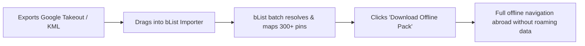

# 🌐 Persona: The Privacy-Conscious Nomad & De-Googler

> **"I travel constantly, often with spotty international eSIMs. I want my saved places in an open format, completely private, and working 100% offline."**

---

## 🎯 Profile & Demographics
- **Primary Devices**: Linux/Mac laptops, GrapheneOS / de-Googled Android or iOS.
- **Behavior**: Self-hosters, open-source advocates, digital nomads living across different cities for months at a time.
- **Key Frustrations**:
  - Trapped in Google Maps walled garden; exporting Takeout data gives useless CSVs without coordinates.
  - Apps that phone home with ad analytics and track GPS locations continuously.
  - When landing in a new country without cellular connectivity, online-only travel apps fail completely.

---

## 🚀 Key User Journeys & Workflows

1. **One-Click Migration**: Import hundreds of past saved places from Google Takeout or KML files seamlessly.
2. **Offline Mode**: Pre-cached bounding box map tiles and stored pin details in browser IndexedDB/CacheStorage.
3. **Data Sovereignty**: Instant one-click export to GeoJSON, KML, and JSON anytime.

---

## 💡 Core Feature Requirements
- **Universal Importer**: Google Takeout, CSV, KML, GeoJSON.
- **Offline Trip Packager**: Bounding box tile pre-fetching.
- **Zero-Telemetry Backend**: Anonymous token authentication.
