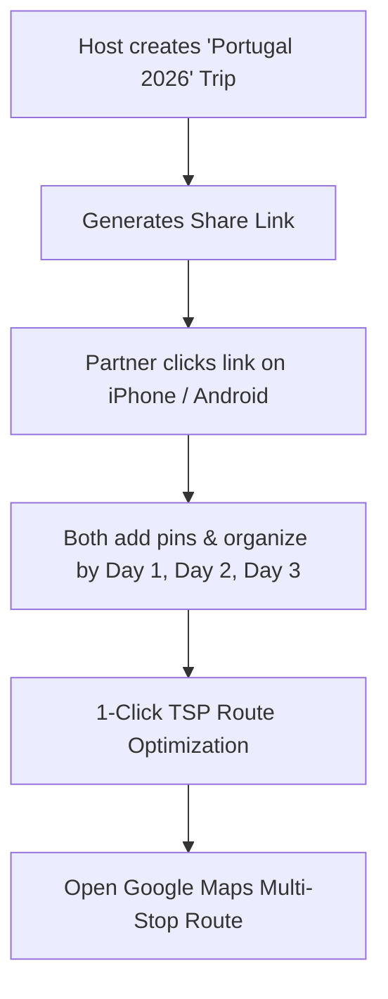

# 👫 Persona: The Couple & Group Trip Planners

> **"We're going to Portugal for 10 days. We need one map where both of us can pin places, organize what to do each day, and figure out the best driving route without paying $50/year for an app."**

---

## 🎯 Profile & Demographics
- **Primary Devices**: Mix of iOS, Android, and Mac/Windows laptops.
- **Behavior**: Researching destinations before an upcoming trip. Both partners/friends want equal ability to add spots and view progress.
- **Key Frustrations**:
  - Apps like Wanderlog paywall live collaboration and offline mode behind a $49.99/year subscription.
  - Google Maps lists force everyone to have a Google account and often fail to sync updates reliably across mobile devices.
  - Lack of daily structure: Having 40 pins on a map is useless without knowing which cluster belongs to Day 1 vs. Day 2.

---

## 🚀 Key User Journeys & Workflows

1. **Frictionless Onboarding**: Host creates a trip, clicks "Share", and sends the URL over WhatsApp/iMessage. Partner joins instantly without making an account.
2. **Day Clustering**: Categorize pins into "Day 1: Lisbon Central", "Day 2: Sintra Castles", "Day 3: Cascais Coast".
3. **Route Optimization**: Single-tap optimization to reorder stops in shortest walking/driving sequence.

---

## 💡 Core Feature Requirements
- **Anonymous Collaborative Sync**: Real-time updates via token-based authorization.
- **Day-by-Day Grouping**: Visual timeline and day filter toggle on the map.
- **Traveling Salesperson Route Optimizer**: Efficient route sequence calculation.
- **Lightweight Expense Tracker**: Estimate and split activity costs.
