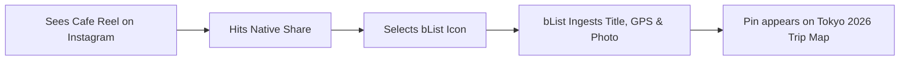

# 📱 Persona: The Spot Collector (Mobile-First Curator)

> **"I see amazing places on Instagram, TikTok, and travel blogs every day. I just want them saved to my map instantly without jumping through hoops."**

---

## 🎯 Profile & Demographics
- **Primary Devices**: iPhone (Safari / iOS PWA) or Android (Chrome / Android PWA).
- **Behavior**: Heavy consumer of travel reels, food blogs (Eater, Infatuation), and Google Maps local searches.
- **Key Frustrations**:
  - Saved places in Google Maps turn into a messy blob of hundreds of yellow stars with no categorization.
  - Screenshots clutter the photo gallery and get forgotten.
  - Saving a spot from Instagram or Safari usually requires manually copying an address, opening Google Maps, searching, and adding to a list.

---

## 🚀 Key User Journeys & Workflows

1. **Direct Share Sheet Ingestion**: User shares an Instagram post or Google Maps link directly to bList via the Web Share Target API.
2. **Instant Visual Feedback**: Place title, hero photo, and GPS coordinates populate automatically.
3. **Surprise Me 🎲 Discovery**: When in a neighborhood, taps "Surprise Me" or "Sort by Nearest" to find nearby saved gems.

---

## 💡 Core Feature Requirements
- **Fast PWA Share Target**: Zero-delay parsing of incoming URLs and strings.
- **Visual Marker Distinction**: Emojis (☕, 🍕, 🏨) on map pins for immediate visual recognition.
- **Custom Tags**: `#rooftop`, `#matcha`, `#sunset`, `#late-night`.
