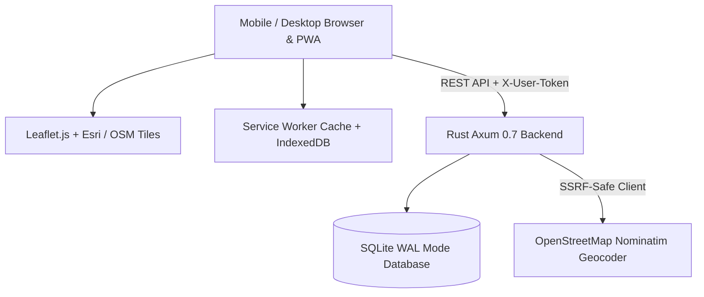

# ⚙️ Technical Architecture & Performance Guidelines

> **Core Philosophy**: Zero-bloat, deterministic execution, extreme responsiveness (<100ms), and strict adherence to web standards.

---

## 🏛️ System Architecture

---

## 🛡️ Non-Negotiable Performance & Engineering Rules

### 1. Rust Axum & Memory Safety Bounds
- **Scraper Html Send Bounds**: As documented in [`AGENTS.md`](../../AGENTS.md), `scraper::Html` does not implement `Send`. All HTML parsing must happen in an isolated synchronous block dropped before any `.await` call.
- **SSRF Hardening**: Every outbound fetch must pass `src/security.rs` (`validate_url_for_ssrf` / `build_safe_http_client`) to prevent access to private IP ranges and internal cloud metadata endpoints.
- **SQLite Concurrency**: SQLite runs in WAL mode with foreign keys enabled (`PRAGMA foreign_keys = ON;`). Keep transactions scoped and brief.

### 2. Frontend Performance & Vanilla Simplicity
- **Zero Build Step**: No Webpack, Vite, or React overhead. All frontend logic remains pure modern ES6+ modules (`static/app.js`, `static/helpers.js`).
- **DOM Injection Security**: Never inject unescaped text into the DOM. Always route strings through `Utils.escapeHtml()` and hyperlinks through `Utils.sanitizeUrl()`.
- **CSS Specificity**: Avoid `!important` on generic utility classes to maintain responsive mobile/desktop visibility utilities.

### 3. PWA & Offline Standards
- Cache map tiles dynamically on request.
- Store offline state in `localStorage` / `IndexedDB` with automatic sync retry upon network restoration.
