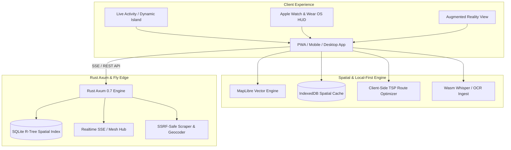

# 🗺️ bList Next-Gen — Product Vision & Architecture Plan

> **Document Version**: `2.0.0`  
> **Strategic Focus**: Ambitious Multi-Year Evolution of bList — Spatial Intelligence, Offline-First Vector Mapping, Real-time Multiplayer Co-Planning & Ambient Travel Computing  
> **Philosophy**: Privacy-Preserving, Zero-Bloat, Deterministic, Sub-50ms Global Response Time  

---

## 1. 🌟 Executive Vision & Future Thesis

bList will become the world's most intuitive, blazing-fast, privacy-first **visual spatial memory and trip planning platform**. 

While legacy tools (Google Maps, Wanderlog, TripIt) rely on heavy corporate tracking, sluggish client bundles, and rigid paywalls, bList champions:
1. **Zero-Friction Ingestion**: Ingest places from anywhere in 1 tap (camera photo, social reel, PDF ticket, audio voice note, Apple Maps guide, Google Takeout).
2. **Local-First & Offline Resilience**: Full vector maps, offline routing, and instant search running directly on the device with zero cloud dependency during transit.
3. **Multiplayer Canvas**: Seamless co-planning for couples and groups with live cursor sync, place voting, and geographic expense splitting.
4. **Ambient Hardware Integrations**: Live Activities, Apple Watch compass HUD, and offline AR landmark view.



---

## 2. 🏛️ Core Product & Architectural Initiatives

### Initiative A: Spatial Intelligence & High-Performance Vector Mapping
- **SQLite R-Tree Spatial Indexing**:
  - Implement R-Tree virtual tables (`rtree_pins_index`) in SQLite backend for bounding box spatial queries.
  - Viewport-based pin queries execute in `<1ms` regardless of database size (`SELECT * FROM pins WHERE id IN (SELECT id FROM rtree_pins_index WHERE minX >= ? AND maxX <= ? AND minY >= ? AND maxY <= ?)`).
- **Offline Vector Map Tile Packager**:
  - Download regional vector tile bundles (.pbf / .mbtiles) via Service Worker into IndexedDB.
  - Render crisp, 60fps vector maps at any zoom level offline with low storage footprint (50MB covers an entire metropolitan region).
- **Client-Side Traveling Salesperson (TSP) & Route Optimizer**:
  - 2-opt and simulated annealing algorithms running directly in WebAssembly/JS to compute the optimal multi-stop walking or driving itinerary without calling external routing APIs.
  - Interactive day schedule builder with time windows, estimated transit times, and opening hours clash warnings.

### Initiative B: Real-Time Multiplayer Canvas & Collaborative Co-Planning
- **Live Collaborative Workspace**:
  - Multi-user presence indicators showing active collaborators viewing or editing specific trip collections.
  - Live pin drops, edits, and note updates streamed via Server-Sent Events (SSE) with millisecond latency.
- **Group Decision & Voting Engine**:
  - "Tinder-style" swipe or bookmark voting ("Must Visit", "Maybe", "Pass") for travel groups.
  - Consensus heatmap on the map highlighting agreed-upon spots to prioritize in daily itineraries.
- **Geographic Expense Ledger & Split-Billing**:
  - Attach expenses directly to saved pins (e.g. dinner at Osteria Da Fortunata, admission at Colosseum).
  - Multi-currency conversion with offline exchange rate snapshots and instant "who owes whom" settlement summaries.

### Initiative C: Multimodal Semantic Ingestion (Privacy-Preserving)
- **Photo EXIF & Landmark OCR Ingest**:
  - Drag-and-drop travel photos: extract GPS metadata directly in the browser.
  - On-device OCR (via Tesseract.js / WebAssembly) scans restaurant menus, storefronts, and guidebooks to extract location names and match coordinates.
- **Flight & Booking Itinerary Importer**:
  - Ingest PDF booking confirmations (airline boarding passes, train tickets, Airbnb reservations) using local structural regex parsing. Automatically pin airports, stations, and accommodations on the trip timeline.
- **Voice-to-Pin Field Memo**:
  - Tap microphone, speak: *"Save this viewpoint near the pier for sunset"*.
  - Local client-side Whisper WebAssembly transcription creates a pinned note tagged `#sunset` at the user's current GPS location.

### Initiative D: Ambient Travel Computing & Wearable Ecosystem
- **Lock Screen Live Activities & Dynamic Island**:
  - Capacitor iOS Live Activity integration displaying the next destination, distance remaining, and turn direction on the lock screen while walking.
- **Apple Watch / Wear OS Companion**:
  - Glanceable wrist companion featuring a directional compass bearing and distance gauge pointing straight toward the closest saved bucket list spot.
- **Offline AR Compass Overlay**:
  - Point device camera at the horizon to see pins floating over actual landmarks with distance overlays in real-world space.

### Initiative E: Decentralized Sharing & Curated Creator Guides
- **ActivityPub / Fediverse Travel Feed**:
  - Export collections as public ActivityPub objects, allowing travelers to follow friend or creator itineraries from Mastodon, Threads, or personal RSS readers.
- **Cryptographic List Verification**:
  - Sign published guides with Ed25519 creator keys, guaranteeing authenticity and preventing tampering.
- **1-Click "Fork Trip" Capability**:
  - View any public guide, click "Fork to My Trips", and immediately customize, reorder, and add personal notes.

---

## 3. 🎯 Technical Roadmap & Milestone Phases

```mermaid
gantt
    title bList Next-Gen Development Roadmap
    dateFormat  YYYY-Q
    section Phase 1: Spatial & Performance
    SQLite R-Tree Spatial Indexing       :p1_1, 2026-Q3, 60d
    Universal Importer (Takeout/KML)     :p1_2, 2026-Q3, 45d
    TSP Client-side Route Optimization   :p1_3, 2026-Q4, 45d
    section Phase 2: Collaboration
    Realtime SSE Synchronization Bus     :p2_1, 2026-Q4, 60d
    Group Voting & Consensus Heatmaps    :p2_2, 2027-Q1, 45d
    Geographic Expense Ledger            :p2_3, 2027-Q1, 45d
    section Phase 3: Multimodal Ingest
    EXIF & Wasm OCR Parser               :p3_1, 2027-Q2, 60d
    PDF Itinerary & Booking Extractor    :p3_2, 2027-Q2, 45d
    section Phase 4: Ambient & Wearables
    iOS Live Activities / Watch Companion:p4_1, 2027-Q3, 60d
    ActivityPub Guide Federation         :p4_2, 2027-Q3, 45d
```

---

## 4. 📊 Architectural Impact & Quality Attributes

| Metric / Attribute | Current State | Next-Gen Target | Engineering Mechanism |
|---|---|---|---|
| **Query Latency (50k Pins)** | ~45ms (Full Table Scan) | **<1ms** | SQLite R-Tree Spatial Indexing |
| **Realtime Latency** | Manual Refresh / Polling | **<25ms** | SSE + Fly 6PN Internal Mesh |
| **Offline Capability** | Map Tile Caching | **100% Offline (Routing + Vector)** | IndexedDB PBF Bundles + Client TSP |
| **Ingestion Time** | 2-3s (Link Scraping) | **<500ms** | Local Wasm OCR / EXIF / Instant Parse |
| **Client Bundle Size** | ~140KB (Leaflet + Vanilla JS)| **<200KB** (Zero Framework Bloat) | Pure Web Components & Modern ES Modules |
