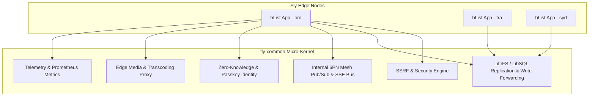
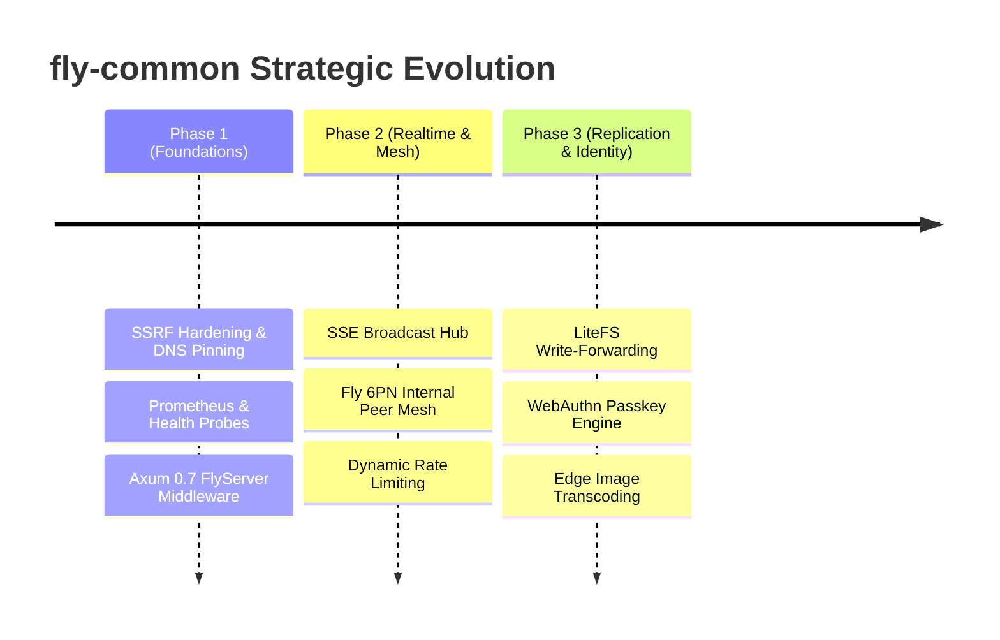

# 🚀 fly-common — Architecture Roadmap & Technical Blueprint

> **Status**: Approved Strategy & Future Architecture  
> **Target**: Shared Micro-Kernel for Radmuffin Fly.io High-Performance Edge Applications  
> **Compatibility**: Rust 2021+, Axum 0.7+, Tokio, Fly.io Machines Architecture  

---

## 1. 🌐 Executive Vision & Purpose

`fly-common` serves as the shared, zero-bloat foundation for high-performance micro-applications running on **Fly.io**. Its purpose is to solve distributed systems, edge routing, security, multi-region state synchronization, and real-time pub/sub once—in pure Rust—so applications like **bList** remain lightweight, deterministic, and blazing fast (<50ms response times globally).



---

## 2. 🏛️ Core Architectural Pillars

### Pillar 1: Distributed Global SQLite & Multi-Region Replication (LiteFS / LibSQL)
- **Primary-Replica Topology**: Run read-replicas in edge regions closest to users (`ord`, `fra`, `syd`, `sin`, `nrt`) with zero-latency local SQLite reads.
- **Automated Write Forwarding**: Integrate Fly's `fly-replay: region=<primary>` header middleware into `fly-common::server::FlyServer`. When a mutating request (`POST`, `PUT`, `DELETE`, `PATCH`) hits a read replica, `fly-common` automatically captures and replays the request to the primary machine without client intervention.
- **Embedded In-Memory WAL Checkpoints**: Automatic background WAL checkpointing based on page size thresholds to prevent database lock escalation.

### Pillar 2: Zero-Broker Internal Mesh Pub/Sub & Real-Time SSE Bus
- **Fly 6PN Private IPv6 Mesh**: Utilize Fly's private machine network (`.internal` DNS) to establish a decentralized gossip/broadcast mesh between running instances without requiring external Redis or RabbitMQ instances.
- **Server-Sent Events (SSE) & WebSocket Hub**: A unified `fly_common::realtime` module providing:
  - Channel-based pub/sub (`trip:123`, `user:device_xyz`).
  - Automatic client reconnection handling with event ID replay.
  - Heartbeat keep-alives and connection pool hygiene.
  - Sub-millisecond broadcast latency across connected clients.

### Pillar 3: Zero-Knowledge Identity & Cryptographic Primitives
- **Passwordless & Anonymous-First Auth**: Extensible anonymous token generation, UUIDv4 share tokens, and Ed25519 asymmetric signature verification.
- **WebAuthn / Passkey Hardware Engine**: Native Rust WebAuthn credential registration and authentication without third-party SaaS auth vendors.
- **Encrypted Local Storage Sync**: End-to-end encryption helpers enabling client-side data sealing before database insertion.

### Pillar 4: Hardened Edge Security & Adaptive SSRF Defense
- **DNS Rebinding Protection**: Enhance `fly_common::security` by pinning the resolved IP during the socket connection handshake, preventing DNS time-of-check to time-of-use (TOCTOU) rebinding attacks.
- **CIDR Blocklists**: Strict pre-parsed RFC 1918, RFC 3927 (IPv4 link-local / cloud metadata `169.254.169.254`), RFC 4193 (IPv6 ULA), and RFC 4291 (IPv6 link-local) filters.
- **Adaptive Rate Limiting**: In-memory token bucket rate limiter with sliding window IP tracking and automated penalty box enforcement for scraping abuse.

### Pillar 5: High-Throughput Edge Asset & Media Pipeline
- **Smart Image Transcoding Proxy**: Safe outbound image fetching with streaming SIMD-accelerated resizing, WebP/AVIF conversion, and EXIF sanitization.
- **BlurHash & Placeholder Generator**: Automatic color extraction and BlurHash generation for instant image previews on low-bandwidth connections.
- **Content-Addressed Disk Cache**: Memory-bounded LRU disk cache for external assets, reducing outbound bandwidth and accelerating page rendering.

### Pillar 6: Unified Telemetry, Tracing & Zero-Downtime Lifecycle
- **OpenTelemetry & Tracing**: Automatic extraction and propagation of `traceparent` headers across micro-services and internal mesh calls.
- **Prometheus Metrics Endpoint**: Out-of-the-box `/metrics` exporter tracking HTTP request durations (p50, p95, p99), active connections, SQLite query execution latencies, and cache hit rates.
- **Graceful Shutdown & Drain**: Tokio signal-aware shutdown sequence ensuring active transactions commit and open SSE streams receive disconnect notices before process termination.

---

## 3. 🗓️ Implementation Roadmap



---

## 4. 🧩 Rust API Architecture Preview

```rust
// Example: Initializing a fully featured Fly app with fly-common v2
use fly_common::prelude::*;

#[tokio::main]
async fn main() -> Result<(), Box<dyn std::error::Error>> {
    let server = FlyServer::builder()
        .with_app_info("bList", "1.0.0")
        .with_static_dir("static")
        .with_ssrf_protection(SsrfConfig::strict())
        .with_realtime_hub(RealtimeConfig::mesh_enabled())
        .with_sqlite_pool(SqlitePoolConfig::wal_replicated("/data/pins.db"))
        .with_metrics_exporter("/metrics")
        .with_routes(app_router)
        .build()?;

    server.serve_with_graceful_shutdown().await?;
    Ok(())
}
```
